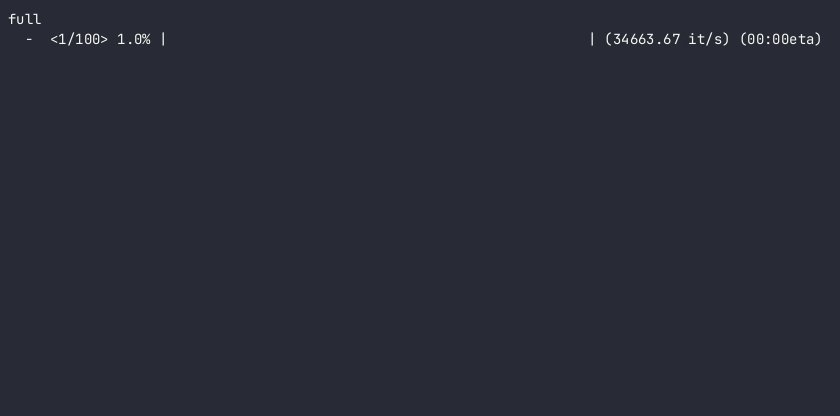

########
fancybar
########

`fancybar` is a highly customizable terminal progress bar library.
Usage is very simple:

.. code_block:: python
        import fancybar
        for i in fancybar.bar(range(100)):
                # Do something

You can also create a bar without an iterable:
.. code_block:: python
        import fancybar
        bar = fancybar.ProgressBar(100)
        with bar:
                # Do something
Bar Types
---------
Please note that not all bar types will work on all terminals!

